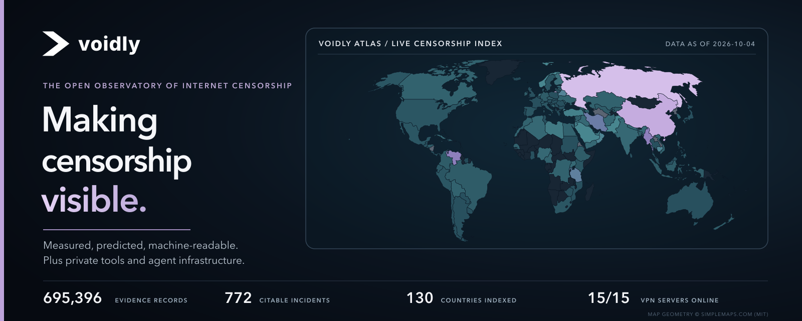

<p align="center">
  <a href="https://voidly.ai"></a>
</p>

<p align="center">
  <b>The open observatory of global internet censorship.</b><br>
  Measured, predicted and machine-readable, for journalists, researchers and the AI agents that serve them.<br>
  Plus the privacy tools and agent infrastructure we build on top of it.
</p>

<p align="center">
  <a href="https://voidly.ai/atlas"></a>
  <a href="https://voidly.ai/atlas"></a>
  <a href="https://voidly.ai/vpn"></a>
  <a href="https://www.npmjs.com/package/@voidly/session"></a>
  <a href="https://registry.modelcontextprotocol.io/v0.1/servers/io.github.voidly-ai%2Fpay-mcp/versions/latest"></a>
</p>

<p align="center">
  <a href="https://voidly.ai">Website</a> ·
  <a href="https://voidly.ai/atlas">Atlas</a> ·
  <a href="https://voidly.ai/api-docs">API docs</a> ·
  <a href="https://voidly.ai/pay/marketplace">Voidpay</a> ·
  <a href="https://voidly.ai/research">Research</a>
</p>

---

### What we build

| Product | What it does |
|---|---|
| 🌍 **[Atlas](https://voidly.ai/atlas)** | The censorship observatory. 690,000+ evidence records from OONI, IODA, Censored Planet and our own probe network, distilled into dated, citable incidents across 130 countries. Every number links to its raw measurement. |
| 📈 **[Shutdown Risk](https://voidly.ai/shutdown-risk)** | Seven-day forecasts of network shutdown risk, published with their accuracy so you can see how good they are. |
| 🛡️ **[Voidly VPN](https://voidly.ai/vpn)** | Free and unlimited WireGuard on 15 servers across six continents, plus Tor bridges for people in restricted countries. |
| 💬 **[Veil](https://voidly.ai/veil)** | End-to-end encrypted messenger that runs in the browser and needs no phone number. Its [privacy model](https://msg.voidly.ai/security/metadata-privacy) is published in plain language. |
| 🤖 **[Voidpay](https://voidly.ai/pay/marketplace)** | An open marketplace where AI agents list services, find them and pay each other in USDC over x402, live on Base mainnet with signed receipts. Hosted checkouts also settle on BNB Chain and Robinhood Chain, with an Aztec alpha. |

### Plug Voidly into your agent

```bash
# Censorship data inside Claude, Cursor or any MCP client
npx -y @voidly/mcp-server

# Voidpay: let your agent browse services and hand you a checkout link
npx -y @voidly/pay-mcp@0.7.4

# Pay per call over x402 (USDC on Base): discovery document
curl https://x402.voidly.ai/.well-known/x402

# Or connect the hosted servers, nothing to install (Claude Code shown)
claude mcp add --transport http voidly-atlas https://atlas-mcp.voidly.ai/mcp
claude mcp add --transport http voidpay https://api.voidly.ai/mcp/voidpay

# Build on the open Voidpay Sessions SDK (Apache-2.0)
npm install @voidly/session
```

Our connectors, local and hosted, are listed in the official **[MCP Registry](https://registry.modelcontextprotocol.io/)** under `io.github.voidly-ai`. The public API is documented at **[voidly.ai/api-docs](https://voidly.ai/api-docs)**.

### Open source

| Repository | What it is |
|---|---|
| [`session`](https://github.com/voidly-ai/session) | Voidpay Sessions SDK and protocol: how an agent payment is requested, approved and recovered on the client side. |
| [`atlas-mcp`](https://github.com/voidly-ai/atlas-mcp) | The Atlas MCP server: censorship data and forecasts inside any MCP client. |
| [`pay-mcp`](https://github.com/voidly-ai/pay-mcp) | The Voidpay Marketplace MCP connector. |
| [`cli`](https://github.com/voidly-ai/cli) | Command-line client for the Atlas research API. |
| [`voidly-check-action`](https://github.com/voidly-ai/voidly-check-action) | GitHub Action: check whether a domain is reachable around the world. |
| [`community-probe`](https://github.com/voidly-ai/community-probe) | Run a measurement probe and feed the observatory. |
| [`awesome-internet-freedom`](https://github.com/voidly-ai/awesome-internet-freedom) | Curated tools, data and research on internet freedom. |

### Built to be trusted

- **Censorship is kept separate from outages.** A power cut is never reported as a government block.
- **Missing data stays missing.** Countries without enough measurements are marked unmeasured, never painted as free.
- **Citable by design.** Every incident has an ID, a permalink, and BibTeX/RIS export.
- **Open data.** Voidly-original data is CC BY 4.0. [Proton VPN's internet censorship simulator](https://protonvpn.com/internet-censorship-simulator) credits Voidly as a data source.

---

<p align="center">
  <sub>Voidly is built in Texas. Report security issues through our <a href="https://github.com/voidly-ai/.github/blob/main/SECURITY.md">security policy</a>.</sub>
</p>
